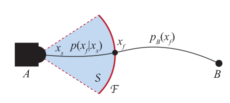
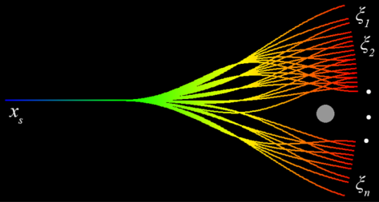

# turtlebot_local_planner

This ROS package implements local planner: Falco: Fast likelihood‐based collision avoidance forked from github [autonomous_exploration_development_environment](https://github.com/HongbiaoZ/autonomous_exploration_development_environment) for the Turtlebot2 robot.The package was designed in [stonefish](https://github.com/patrykcieslak/stonefish) simulator using [Turtlebot2](https://bitbucket.org/udg_cirs/turtlebot_simulation/src/master/) Simulation Packages. The package was tested on ROS Noetic running on Ubuntu 20.04 Machine.

## Overview
This project follow literature of paper [Falco](https://doi.org/10.1002/rob.21952). Basically, The method aims to maximize the likelihood of a vehicle successfully navigating from point A to point B. Obstacles within the sensor range are considered deterministically known based on perception sensors, while obstacles beyond this range
are treated probabilistically if a prior map is available. This dual representation allows the method to efficiently handle environmental uncertainties. The probability density function for the vehicle to reach B from an initial state xs is denoted
as $p(x_B|x_s)$. 

<div align="center">
    
</div>

Given the start state xs, a path is defined as the trajectory
connecting points A and B. All possible paths must intersect with the sensor frontier, represented by F. The state of the vehicle while passing $(\mathcal{F})$ is denoted as $(x_f)$. The conditional distribution of $(x_f)$ given $(x_s)$, $(p(x_f|x_s))$, is derived from the obstacle information provided by the perception sensors. The probability density for the vehicle to reach B from $(x_f)$, $(p(x_B|x_f))$, can be calculated based on the obstacles on the prior map.

To approximate the probability density, Monte Carlo sampling is used. For \( n \) samples drawn from $(p(x_f|x_s))$, the probability density $(p(x_B|x_s))$ can be approximated as:

$p(x_B \mid x_s) \approx \frac{1}{n} \sum_{i=1}^n p(x_B \mid \xi_i)$

where $(\xi_i)$ are the samples of $(x_f)$.

- Local Probabilities
  The method utilizes path groups, which are sets of paths sharing the same start state $(x_s)$. Each path in a group is generated as a cubic spline curve, splitting into multiple directions both horizontally and vertically. For instance, if there are 7 horizontal and 5 vertical directions, a total of 35 path groups can be created, resulting in 42,875 paths. During navigation, obstacles detected by the perception sensors occlude certain paths, and the path clearance is indicated by a Boolean function $(c(\xi_i))$.

    The probability $(P(x_B \mid x_s))$ is computed as:

    $P(x_B \mid x_s) \approx \frac{\sum_{i=1}^n c(\xi_i) p(x_B \mid \xi_i)}{\sum_{i=1}^n c(\xi_i)}$


<div align="center">
    
</div>

- Global Probabilities: The environment is represented using voxels that include both position and orientation information. Each voxel state $(x_{j,k})$ includes a voxel index $( j )$ and a direction index $( k )$. The probability density to reach B from $( x_{j,k} )$, $( p(x_B \mid x_{j,k}) )$, is calculated iteratively. During initialization, probability densities are evenly distributed among all directions within the voxel containing B. The algorithm iterates through the paths to update the probability densities until the changes fall below a threshold.

## Project Architecture
The turtlebot_local_planner includes several packages:

- **depth_camera**: This package subcribes depth image message, convert it to 3D point cloud in the camera frame then publish it.
- **laser_handle**: This package subcribes 2D lidar then extend it to be 3D lidar (just extend along Z axis, we developed it in case we do not have depth camera or data not good enough, we can use extended laser scan as an alternative solution). Besides, note when extending, we need to fill the floor.
- **loam_interface**: This package is an inteface with loam.
- **local_planner**: This package follow the paper above to do local planner. This package contains 2 node: local_planner which computes the best path and path_follower which follow the path computed linear and angular velocity for the turtlebot from local_planner.
- **navigation**: The package does a simple EKF filter with odometry and heading measurement to localize robot pose.
- **sensor_scan_generation**: As mention above, 3D point cloud we have from depth camera or laser scan is in sensor frame. So in this package, we convert it to "map" frame by sync with robot pose.
- **stonefish_interface**: The package is an interface with [stonefish](https://github.com/patrykcieslak/stonefish) simulator. In this package, there is a node converting the linear and angular velocity to wheel velocity of the robot. 
- **terrain_analysis**: Not used now.
- **terrain_analysis_ext**: Not used now.


## Dependencies

This package has the following dependencies:

- ROS Noetic
- Stonefish Simulator
- Turtlebot Simulation Packages
- PCL Library
- Eigen Library
- Boost Library


## Installation

To install the turtlebot_local_planner package, follow these steps:

### Install the dependencies:
1. ROS Noetic: Follow the instructions [here](http://wiki.ros.org/noetic/Installation/Ubuntu).
2. Stonefish Simulator: Follow the instructions [here](https://github.com/patrykcieslak/stonefish)
3. Turtlebot Simulation Packages: Follow the instructions [here](https://bitbucket.org/udg_cirs/turtlebot_simulation/src/master/)
4. PCL Library: Follow the instructions [here](https://pointclouds.org/downloads/)
5. If you don't have Eigen and Boost libraries installed, you can install them using the following commands:
    ```
    $ sudo apt install libeigen3-dev
    $ sudo apt install libboost-all-dev
    ```
### Build the package:

To build the turtlebot_graph_slam package, follow these steps:
1. Clone the repository into your ROS catkin workspace:
    ```
    $ git clone https://github.com/LeoPhamVN/turtlebot_localplanner
    ```

2. Build the package:
    ```
    $ cd ~/catkin_ws
    $ catkin build
    ```
    if you dont have catkin tools installed, you can install it from [here](https://catkin-tools.readthedocs.io/en/latest/installing.html)

3. Source the setup file:
    ```
    $ source devel/setup.bash
    ```
    You can add this line to your `.bashrc` file to run it automatically when you open a new terminal.
    
4. If while building the package can not find the PCL, Eigen and Boost library, provide necessary path to the library in CMakeLists.txt file.

## Usage

### IMPORTANT!!
1. There are 2 modes:

* SIL - Software in Loop when working in Simulator.
* HIL - Hardware in Loop when working on real turtlebot robot.

To use the turtlebot_local_planner package in the simulation, follow these steps:

If you are using the stonefish simulator, you can launch the turtlebot_local_planner package using the following command:
```
$ roslaunch stonefish_interface env_SIL.launch
```

This file is going to launch `turtlebot_integration.launch` file from turtlebot_simulation package. This file is going to launch the turtlebot in the stonefish simulator. 


If you are using the real turtlebot robot, you can launch the turtlebot_local_planner package using the following command:

```
$ roslaunch stonefish_interface env_HIL.launch
```


## Parameters

The turtlebot_local_planner package provides the following parameter groups:

- `depth_camera`: [params](/src/depth_camera/config/depth_camera_config.yaml).
- `laser_handle`: [params](/src/laser_handle/config/laser_handle_config.yaml).
- `local_planner`: [params](/src/local_planner/config/local_planner_config.yaml).
- `sensor_generation`: [params_SIL](/src/sensor_scan_generation/config/sensor_scan_generation_SIL_config.yaml) and [params_HIL](/src/sensor_scan_generation/config/sensor_scan_generation_HIL_config.yaml) 
- `navigation`: [params](/src/navigation/src/config.py) 

## Launch Files

For each package, there is a launch file for those. But we can run whole project by the following launch files:

- `env_SIL.launch`: Launches the turtlebot_graph_slam package in the stonefish simulator.
- `env_HIL.launch`: Launches the turtlebot_graph_slam package in the real turtlebot robot.

## Results
1. Moving point to point:
<div align="center">

</div>

2. Simulation Testing:

<div align="center">

</div>

3. Real World Testing:

<div align="center">

</div>

<!-- The testing video can be found on [Youtube](https://youtu.be/LJ4F1GPrkgc?si=MMji7D_SDVsXrU04) -->

## Future Work
1. Enhance cost function in the local planner. Developed for more type of sensors.
2. Develop new local planner alow setting direction sush as Dubin path.

### Lastly

*Don't forget to touch some grass!!*

## Contact

If you have any questions or suggestions, feel free to open an issue or contact me by [Email](mailto:phamthanhloc.bkhn@gmail.com).